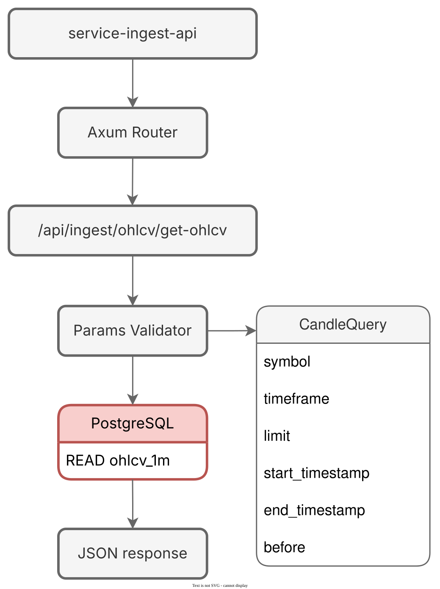

# service-ingest-api

Microservice responsible for serving normalized **OHLCV (candlestick) market data** to other microservices within the platform.
It provides a **read-only HTTP API** optimized for low-latency access to time-series candle data used by charting UIs, analytics services, and downstream ingestion pipelines.

## Design

- **Single responsibility**: read-only access to market candle data
- **Strict input validation** using `validator`
- **Unified error handling** via `AppError`
- **Safe SQL construction** using `sqlx::QueryBuilder`
- **Stateless and concurrent** (Axum + async PostgreSQL pool)
- **Internal-first API design**
  - No versioning (single team, coordinated deployments)
  - Fast iteration and schema evolution
- Data is queried using `ORDER BY open_time DESC` to safely retrieve the **latest candles**
- Results are reversed in-memory before responding
- Final output is always **chronologically ordered (oldest → newest)**

This behavior is compatible with charting libraries.

## Consumers

This service is **not public-facing**.

It is intended to be consumed by internal services such as:

- service-feed

## Error Handling

All errors are returned using a unified error format via `AppError`, including:

- Validation errors
- Bad requests
- Internal server errors

This ensures consistent error handling across all endpoints.


## Architecture





## OHLCV Endpoint

- `GET /api/ingest/ohlcv/get-ohlcv`
- Query params:
  - `symbol=BTCUSDT`
  - `timeframe=1m`
  - `limit=500`
  - `before=<cursor>`


### Query Parameters

| Name             | Type   | Required | Description |
|------------------|--------|----------|-------------|
| `symbol`         | string | Yes      | Trading symbol (e.g. `BTCUSDT`) |
| `timeframe`      | string | Yes      | Candle timeframe (currently only `1m`) |
| `limit`          | number | No       | Maximum number of candles (capped) |
| `start_timestamp`| number | No       | Start time (Unix ms) |
| `end_timestamp`  | number | No       | End time (Unix ms) |
| `before`         | number | No       | Cursor             |

### Response

Each element in the response array represents a **single candlestick (OHLCV)** for a given symbol and timeframe.

```json
]
{
  "symbol": "BTCUSDT",
  "open_time": 1769274000000,
  "close_time": 1769274059999,
  "open": 89290.01,
  "high": 89290.01,
  "low": 89252.93,
  "close": 89280.7,
  "volume": 6.421050000000006
}
]

```