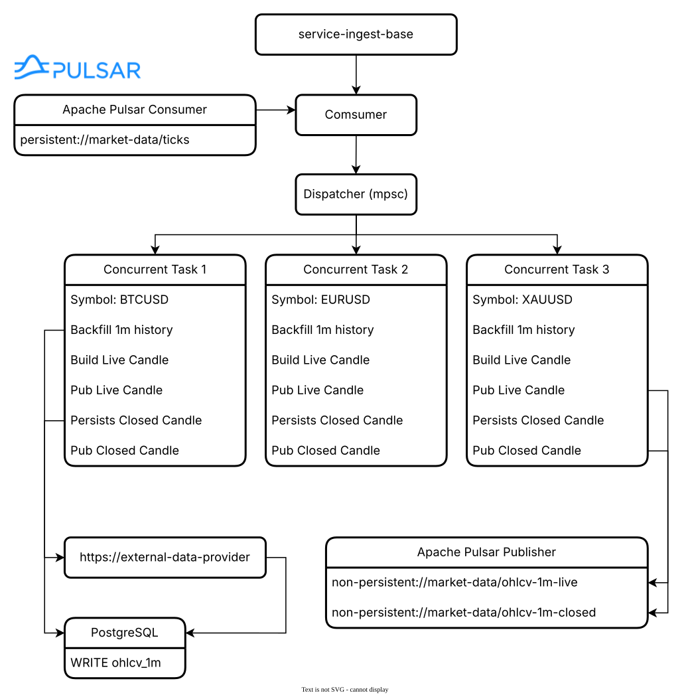

# ⚙️ service-ingest-base

This microservice is the canonical source of OHLCV pricing data for the system.

At startup, the service initializes its runtime dependencies (configuration, PostgreSQL, Pulsar) and ensures that the required storage schema is present. A single Pulsar consumer is then started to receive raw trade ticks.

Incoming ticks are processed by a central dispatcher, which is responsible for dynamically spawning and managing symbol-specific worker tasks. Each symbol is handled by exactly one worker, and ticks are routed to workers through bounded MPSC channels to guarantee ordered, per-symbol processing.

When a symbol worker starts, it performs a one-time bootstrap step by backfilling historical 1-minute candles from the configured external market data provider and persisting any missing candles into PostgreSQL. The system treats 1-minute candles as the sole source of truth.

After initialization, each worker enters a real-time event loop where it processes ticks sequentially, maintains the current live 1-minute candle entirely in memory, and publishes live updates for downstream consumers.

When a minute boundary is detected, the active candle is finalized, persisted to PostgreSQL as an immutable record, and published as a closed candle event. A new live candle is then initialized from the first tick of the next minute.

Live candles are never persisted. Only closed, finalized 1-minute candles are stored and exposed as authoritative historical data.





The main `useData()` API can be used to access site, theme, and page data for the current page. It works in both `.md` and `.vue` files:

```md
<script setup>
import { useData } from 'vitepress'

const { theme, page, frontmatter } = useData()
</script>

## Results

### Theme Data
<pre>{{ theme }}</pre>

### Page Data
<pre>{{ page }}</pre>

### Page Frontmatter
<pre>{{ frontmatter }}</pre>
```

<script setup>
import { useData } from 'vitepress'

const { site, theme, page, frontmatter } = useData()
</script>

## Results

### Theme Data
<pre>{{ theme }}</pre>

### Page Data
<pre>{{ page }}</pre>

### Page Frontmatter
<pre>{{ frontmatter }}</pre>

## More

Check out the documentation for the [full list of runtime APIs](https://vitepress.dev/reference/runtime-api#usedata).
